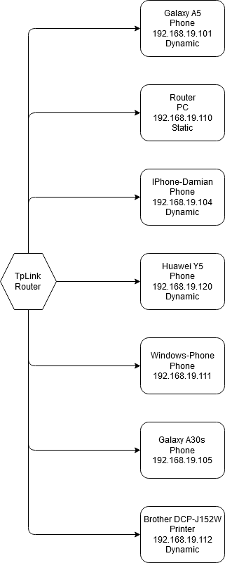

## System operacyjny w środowisku sieciowym

### Zadania


1. Z wykorzystaniem maszyny wirtualnej, zainstaluj SO oraz wypisz parametry konfiguracji IP tj:
   * Adres
   * Maska
   * Adres bramy
   * DNS 1
   * DNS 2
    
    Powyższe parametry uzyskaj na wszystkich z wymienionych systemów

   * [Linux Alpine](https://alpinelinux.org/)
   * [Linux Debian](https://www.debian.org/)
   * [Linux CentOS](https://www.centos.org/)
   * Windows 

2. Sprawdź oraz przygotuj charakterystykę dla przykładowego urządzenia w Twojej sieci domowej
   * Adres
   * Maska
   * Adres bramy
   * DNS 1
   * DNS 2
  
    Przygotuj dokumentację graficzną Twojej sieci domowej, uwzględnij adresy i urządzenia

3. Zarejestruj konto w CISCO Academy celem pobrania Packet tracer 
   https://www.netacad.com/courses/packet-tracer

4. Dlaczego umiejętnosci z zakresu sieci komputerowych mogą mi się przydać? :)


Zadanie 1
### Charakterystyka systemu operacyjnego Linux Alpine

| Charakterystyka           | wartość               | komentarzu                |
| -------------             |:-------------:        | -----:                    |
| nazwa                     | Linux                 | Alpine 3.11.3             |
| cfg interfejsów           |                       |                           |
| program (parametry sieci) |                       |                           |
| ....                      | .....                 |                           |
| nazwa                     | Alpine Linux          |                           |
| Konfiguracja ip           | ip addr show          | Wypisuje karty i adresy ip| 
| Tablica routingu          | ip route show         | Można sprawdzić bramę     | 
| check nameservers (DNS)   | cat /etc/resolv.conf  | Sprawdzamy servery DNS    | 

### Konfiguracja połączenia sieciowego w Linux Alpine

| Parametr | wartość           | komentarzu |
| ------------- |:-------------:| -----:|
| Adres IP      | 10.0.2.15        | przydzielony przez DHCP |
| Maska podsieci| 10.0.2.15/**24** | **255.255.255.0**    |
| Brama         | 10.0.2.2         | default from route table |
| DNS 1         | 192.168.19.1     | cat /etc/resolv.conf     |
| DNS 2         | 0.0.0.0          | nslookup uek.krakow.pl   |
---------------------------------------------------------------

### Charakterystyka systemu operacyjnego Linux Debian

| Charakterystyka           | wartość               | komentarzu                |
| -------------             |:-------------:        | -----:                    |
| nazwa                     | Linux                 | Debian 10.3.0             |
| cfg interfejsów           |                       |                           |
| program (parametry sieci) |                       |                           |
| ....                      | .....                 |                           |
| nazwa                     | Debian Linux          |                           |
| Konfiguracja ip           |    ip addr            | Wypisuje karty i adresy ip| 
| Tablica routingu          | ip route show         | Można sprawdzić bramę     | 
| check nameservers (DNS)   | cat /etc/resolv.conf  | Sprawdzamy servery DNS    | 

### Konfiguracja połączenia sieciowego w Linux Debian

| Parametr | wartość           | komentarzu |
| ------------- |:-------------:| -----:|
| Adres IP      | 10.0.2.15        | przydzielony przez DHCP |
| Maska podsieci| 10.0.2.15/**24** | **255.255.255.0**    |
| Brama         | 10.0.2.2         | default from route table |
| DNS 1         | 192.168.19.1     | cat /etc/resolv.conf     |
| DNS 2         | 0.0.0.0          | nslookup uek.krakow.pl   |
---------------------------------------------------------------

### Charakterystyka systemu operacyjnego CentOS

| Charakterystyka           | wartość               | komentarzu                |
| -------------             |:-------------:        | -----:                    |
| nazwa                     | Linux                 | CentOS 8.1.1911                  |
| cfg interfejsów           |  |          |
| program (parametry sieci) |                |                           |
| ....                      | .....                 |                           |
| nazwa                     | CentOS Linux          |                           |
| Konfiguracja ip           | ``$ ip all ``         | show all eth interfaces   | 
| Tablica routingu          | ``$ ip route show ``  | what is gateway?!         | 
| check nameservers (DNS)   | ``$ cat /etc/resolv.conf ``  | which DNS were set | 

### Konfiguracja połączenia sieciowego w CentOs

| Parametr | wartość           | komentarzu |
| ------------- |:-------------:| -----:|
| Adres IP      | 10.0.2.15        | przydzielony przez DHCP |        
| Maska podsieci| 10.0.2.15/**24** | **255.255.255.0**    |          
| Brama         | 10.0.2.2    | default from route table |          
| DNS 1         | 192.168.19.1     | cat /etc/resolv.conf     |      
| DNS 2         |           | nslookup uek.krakow.pl   |             

 Trzeba włączyć połączenie sieciowe, ale i
 tak dziwna konfiguracja adapterów sieciowych, ip i reszty (Gateway, DNS)
 Plik resolv powstaje po aktywacji karty sieciowej
 i ma dziwny adres DNS (Adres rutera domowego a nie jak
 w powyższych przypadkach)
---------------------------------------------------------------
### Charakterystyka systemu operacyjnego Windows 10

| Charakterystyka              | wartość                      | komentarzu                   |
| ---------------------------- | ---------------------------- | ---------------------------- |
| nazwa                        | Windows 10                   |    Kompilacja 18363          |
| cfg interfejsów              |                              |                              |
| program (parametry sieci)    |                              |                              |
| ....                         | .....                        |                              |
| nazwa                        | Windows 10                 |                              |
| Konfiguracja ip              | ipconfig               | show all eth interfaces   | 
| Tablica routingu             | ip route show         | what is gateway?!         | 
| check nameservers (DNS)      | status sieci  | which DNS were set | 

### Konfiguracja połączenia sieciowego

| Parametr | wartość           | komentarzu |
| ------------- |:-------------:| -----:|
| Adres IP      | 192.168.19.110        | przydzielony przez DHCP |
| Maska podsieci| 192.168.19.110/**24** | **255.255.255.0**    |
| Brama         | 192.168.19.1         | default from route table |
| DNS 1         | 192.168.19.1     | status sieci     |
| DNS 2         | 0.0.0.0          | nslookup UnKNOW   |
---------------------------------------------------------------

Zadanie 2
Drukarka Brother DCP-J152W
   * Adres - 192.168.19.112
   * Maska - 255.255.255.0
   * Adres bramy - 192.168.19.1
   * DNS 1 - 192.168.19.1
   * DNS 2 - 0.0.0.0
  
    Przygotuj dokumentację graficzną Twojej sieci domowej, uwzględnij adresy i urządzenia
### Schemat sieci

aby załączyć obrazek 

```markdown


```



