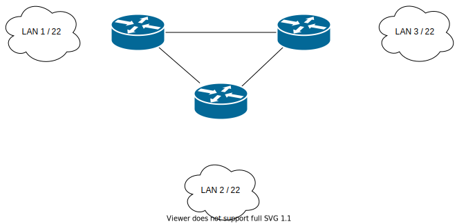

# Zadanie 1

Organizacja planuje rozpoczęcie działalności w 3 budynkach, w każdym z nich przewiduje do 1000 urządzeń IP

1. Zaprojektuj oraz udokumentuj prototyp rozwiązania z wykorzystaniem oprogramowania ``CISCO Packet Tracer``, ``VirtualBox`` lub podobnego. 

## Schemat

## Zawartość

 * Adresy poszczególnych sieci IP
 * Adresację linków pomiędzy routerami
 * Tablice routingów na poszczególnych routerach
 
 

# Sieci
|Sieć           | Lan1 (Oddział firmy)  | Lan2 (Sieć Domowa) | Sieć Lan3 (Siedziba firmy) |
|---------------|:---------------------:|:------------------:|---------------------------:|
|Adres          | 192.168.111.0/22      | 192.168.115.0/22   | 192.168.119.0/22           |
|Maska podsieci | 255.255.252.0         | 255.255.252.0      | 255.255.252.0              |

# Routery

* Router RO  
Lan1
Adres: 192.168.111.1/22  
Maska: 255.255.252.0  
RO->RD: 
Adres: 10.10.10.1/30  
Maska: 255.255.255.252  
RO->RS: 
Adres: 10.10.10.5/30  
Maska: 255.255.255.252  

* Router RD  
Lan2
Adres: 192.168.115.1/22  
Maska: 255.255.252.0  
RD->RO: 
Adres: 10.10.10.2/30  
Maska: 255.255.255.252  
RD->RS: 
Adres: 10.10.10.9/30  
Maska: 255.255.255.252  

* Router RS  
Lan3
Adres: 192.168.115.1/22  
Maska: 255.255.252.0  
RS->RO: 
Adres: 10.10.10.6/30  
Maska: 255.255.255.252  
RS->RD: 
Adres: 10.10.10.10/30  
Maska: 255.255.255.252  

 * Routing Table
|Sieć       | Router (Oddział firmy)             | Router (Sieć Domowa)                | Router Lan3 (Siedziba firmy)       |
|-----------|:----------------------------------:|:-----------------------------------:|-----------------------------------:|
|Adres 1.   | 192.168.112.0/22 via 10.10.10.2/30 | 192.168.108.0/22 via 10.10.10.1/30  | 192.168.108.0/22 via 10.10.10.5/30 |
|Adres 2.   | 192.168.116.0/22 via 10.10.10.6/30 | 192.168.119.0/22 via 10.10.10.10/30 | 192.168.115.0/22 via 10.10.10.9/30 |

