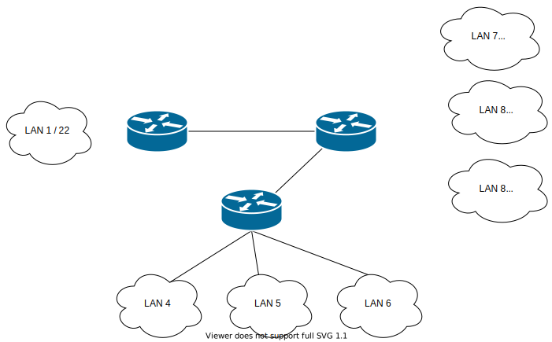

# Zadanie 2

Projekt sieci spełnił oczekiwania, organizacja po uwzględnieniu nowych wymogów chce podzielić dotychczasowe sieci na kilka podsieci.

1. Zaprojektuj oraz udokumentuj prototyp rozwiązania z wykorzystaniem oprogramowania ``CISCO Packet Tracer``, ``VirtualBox`` lub podobnego. 

## Schemat

## Charakterystyka
  * LAN 1 pozostaje bez zmian
  * LAN 2 zostaje podzielony na 3 równe podsieci
  * LAN 3 zostaje podzielony na 3 podsieci z uwzględnieniem
    * podsieć 1 ma obsłużyć do 512 hostów
    * podsieć 2 ma obsłużyć do 10 hostów
    * podsieć 3 ma obsłużyć do 32 hostów
  * Usunięty został również link pomiędzy Routerem (LAN 1) a Routerem (LAN 2)
  * Uwzględnij zmiany w tablicy routingów

## Zawartość

 * Adresy poszczególnych sieci IP
 * Adresację linków pomiędzy routerami
 * Tablice routingów na poszczególnych routerach
 
 
 
 # Sieci
|Sieć           | Lan1 (Oddział firmy)  | Lan2 (Sieć Domowa) | Sieć Lan7 (Siedziba firmy) | Sieć Lan8 (Dział sprzedaży) | Sieć Lan9 (Dział ogólny)|
|---------------|:---------------------:|:------------------:|:--------------------------:|:---------------------------:|---------------------------:|
|Adres          | 192.168.111.0/22      | 192.168.115.0/22   | 192.168.116.0/22           | 192.168.120.0/23            | 192.168.122/23|
|Maska podsieci | 255.255.252.0         | 255.255.252.0      | 255.255.252.0              |255.255.254.0                |255.255.254.0                                     |

# Routery

* Router RO  
Lan1
Adres: 192.168.111.1/22  
Maska: 255.255.252.0  
  
RO->RS: 
Adres: 10.10.10.5/30  
Maska: 255.255.255.252  

* Router RD  
Lan2
Adres: 192.168.115.1/22  
Maska: 255.255.252.0  
 
RD->RS: 
Adres: 10.10.10.9/30  
Maska: 255.255.255.252  

* Router RS  
Lan3
Adres: 192.168.115.1/22  
Maska: 255.255.252.0  
RS->RO: 
Adres: 10.10.10.6/30  
Maska: 255.255.255.252  
RS->RD: 
Adres: 10.10.10.10/30  
Maska: 255.255.255.252  

 * Routing Table
 
|Sieć        | Router (Oddział firmy)             | Router (Sieć Domowa)                | Router Lan3 (Siedziba firmy)       |
|------------|:----------------------------------:|:-----------------------------------:|:----------------------------------:|
|Adres1.     | 192.168.115.0/24 via 10.10.10.2/30 | 192.168.108.0/22 via 10.10.10.1/30  | 192.168.108.0/22 via 10.10.10.5/30 |
|Adres2.     | 192.168.115.0/24 via 10.10.10.6/30 | 192.168.108.0/22 via 10.10.10.10/30 | 192.168.115.0/22 via 10.10.10.9/30 |
|Adres3.     | 192.168.116.0/22 via 10.10.10.6/30 | 192.168.116.0/22 via 10.10.10.10/30 |                                    |
|Adres4.     | 192.168.120.0/23 via 10.10.10.6/30 | 192.168.120.0/23 via 10.10.10.10/30 |                                    |
|Adres5.     | 192.168.122.0/23 via 10.10.10.6/30 | 192.168.122.0/23 via 10.10.10.10/30 |                                    |

Adres w Lan 1 nie są adresami z początku sieci związane jest to tulko z wygodą w testowaniu i zapamiętaniu.
Adres z Lan 3 przeniosłem na początek.
