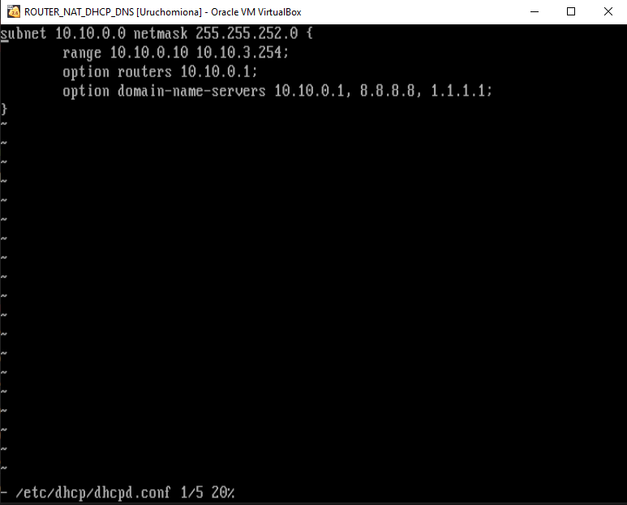

# Zadanie 1

Organizacja planuje ulepszyć działanie istniejącej sieci biurowej.

1. Zaprojektuj oraz udokumentuj konfigurację prototypu rozwiązania z wykorzystaniem oprogramowania ``VirtualBox`` lub podobnego. 

## Schemat

## Wymagania

W sieci pracują komputery biurowe oraz urządzenia siecowe współdzielące zasoby. Do tej pory organizacja borykała się z ręczna konfiguracją urządzeń oraz adresami IP które dla ludzi z poza kadry technicznej były niezrozumiałe. Postanowiono:

* Wykorzystać usługę DHCP do nadawania adresów w sposób automatyczny dla wszystkich stacji roboczych
* Serwer oraz durządzenia IP tj: drukarka muszą posiadać stałe adresy celem zminimalizowanai potrzeby rekonfiguracji ustawiań klientów
* Wprowadzić translację pomiędzy Adresami IP oraz nazwami domenowymi dla kluczowych zasobów
   - erp.mojaorganizacja.pl
   - drukarka.mojaorganizacja.pl
   - router.mojaorganizacja.pl
* Wszystkie urządzenia łączą się z siecią internet z wykorzystaniem bramy NAT
* Wykorzystać podsieć rozmiaru /22 pozwalającej zaadresować co najmniej 600 urządzeń

## Zawartość dokumentacji

 * Charakterystyka rozwiazania 
 * Adresy sieci IP
 * Oprogramowanie wykorzystane do realizacji poszczególnych wymagań
 * Kluczowa konfiguracja oprogramowania pozwalająca na odtworzenie stanu po reinstalacji środowiska
    1. Konfiguracja NAT z iptables 
    2. Konfiguracja DHCP
    3. Konfiguracja DNS
    4. Konfiguracja interfejsów sieciowych
    5. Inne jeżeli wykorzystane

## Przebieg ćwiczenia
   * Konfiguracja maszyn
      1. Utworzono sieć w ustawieniach globalnych o nazwie ZADANIE i adresacji 10.10.0.0/22
      2. Utworzono maszynę router i ustawiono interfejs 1 w tryb NAT oraz interfejs 2 w tryb sieć NAT i przyłączono do sieci ZADANIE
      3. Utworzono maszynę PC0 i ustawiono interfejs 1 w tryb tryb sieć NAT i przyłączono do sieci ZADANIE
   * Konfigurowanie środowiska na Routerze(Ustawienie DHCP i tablicy routingu)
      1. Sprawdzeno połączenia z internetem komendą 'ping google.pl'
      2. Pobrano serwera DHCP 'apk add dhcp'
      3. Skonfigurowano dhcp w '/etc/dhcp/dhcpd.conf'
      
      4. Restart demona dhcp 'service dhcpd restart'
      5. Skonfigurowano interfejsów w '/etc/network/interfaces'
      
      6. Skonfigurowano forwardowanie pakietów komendą 'sysctl net.ipv4.ip_forward=1'
      7. Dodano programu iptables 'apk add iptables'
      8. Dodano translację adresów publicznych na prywatne 'iptables -t nat -A POSTROUTING -o eth0 -j MASQUERADE'
      9. Uruchomiono PC0 i sprawdzono adres ip wraz z tablicą routingu
      
      10. Sprawdzono komunikację z google.pl 'ping google.pl'
   * Konfigurowanie DNS
      1. Pobrano DNS 'apk add dnsmasq'
      2. Uruchomiono DNS 'service dnsmasq start'
      3. Uruchomiono 'ping google.pl'
      4. Dodano wpisy do '/etc/hosts'
         10.10.0.1   router.mojaorganizacja.pl
         10.10.0.2   erp.mojaorganizacja.pl
         10.10.0.3   drukarka.mojaorganizacja.pl